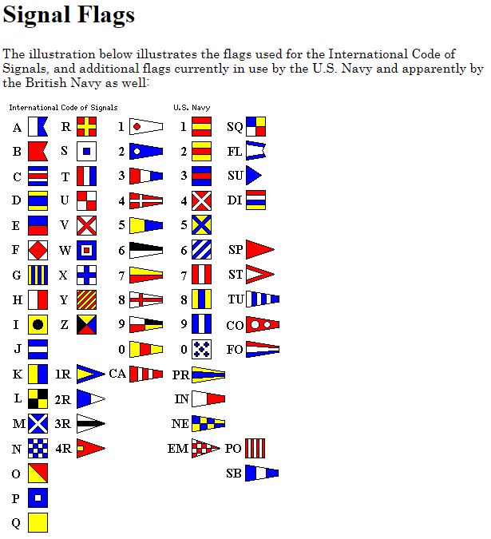

# Flags
Points: 200
## Category
Cryptography
## Problem Statement
> What do the [flags](flag.png) mean?
## Hints
> The flag is in the format PICOCTF{}
## Solution
When we view this image, we see a sequence of decorated squares. Upon seeing this, any navy enthusiast would immediately recognise the Internation Code of Signals. These signals are a common type of maritime flag signalling cryptography. Simply decode the signals to their respective uppercase characters and get the flag.

## Flag
`PICOCTF{F1AG5AND5TUFF}`