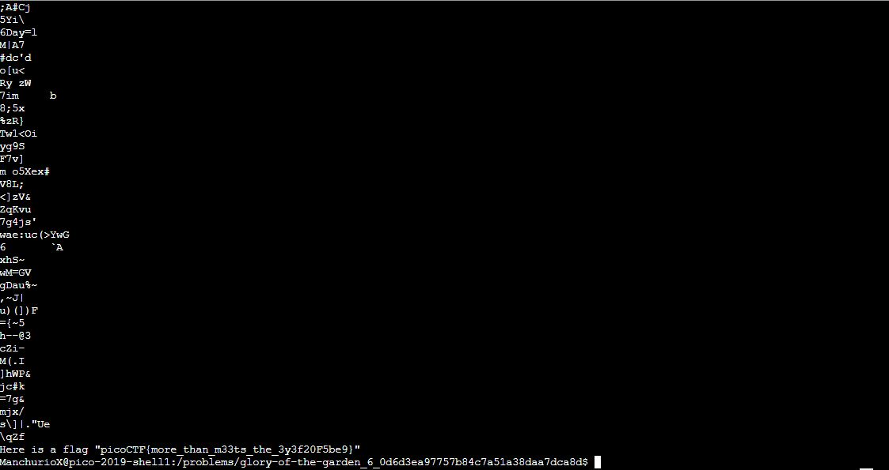

# Glory of the Garden
Points: 50
## Category
Forensics
## Problem Statement
> This [garden](garden.jpg) contains more than it seems. You can also find the file in /problems/glory-of-the-garden_6_0d6d3ea97757b84c7a51a38daa7dca8d on the shell server.
## Hints
> What is a hex editor?
## Solution
When we look at this file in the shell, we can see that it is a binary file, and simply using `cat garden.jpg` does not get us anything useful. Here, we can use `strings garden.jpg`. The `strings` program finds and prints text strings that are embedded in a binary file. Once we execute that, we see the flag printed out.

## Flag
`picoCTF{more_than_m33ts_the_3y3f20F5be9}`