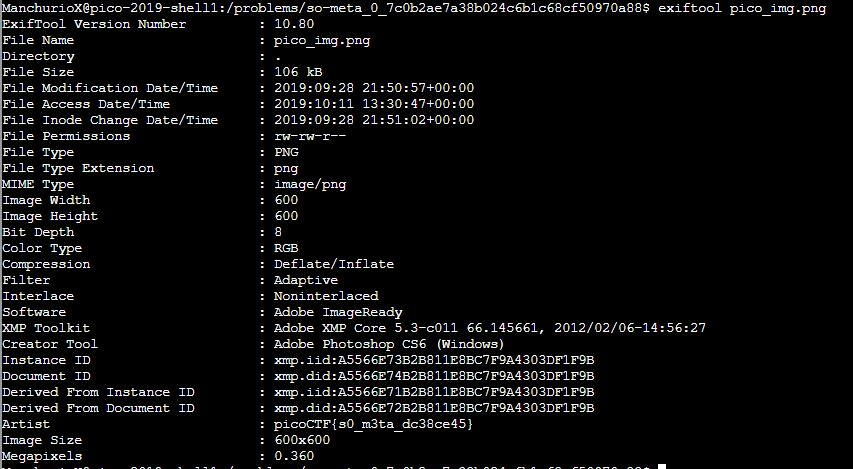

# So Meta
Points: 150
## Category
Forensics
## Problem Statement
> Find the flag in this [picture](pico_img.png). You can also find the file in /problems/so-meta_0_7c0b2ae7a38b024c6b1c68cf50970a88.
## Hints
> What does meta mean in the context of files?
> Ever hear of metadata?
## Solution
The title and hint point towards checking this file's metadata. There are a number ways to do this, though I used `exiftool`, which gives detailed information about a file. The command in the shell was `exiftool pico_img.png`. The flag can be seen as the file's artist.

## Flag
`picoCTF{s0_m3ta_dc38ce45}`