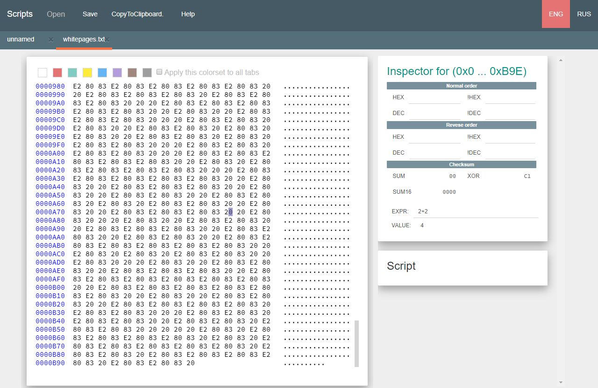

# WhitePages
Points: 250
## Category
Forensics
## Problem Statement
> I stopped using YellowPages and moved onto WhitePages... but the page they gave me is all blank!
## Solution
We see here nothing but whitespace characters. However, we can note that there are different types of whitespace characters. When we hex dump the file on a [hex editor](https://hex-works.com/eng), we see the [UTF-8 codes](https://www.utf8-chartable.de/unicode-utf8-table.pl?start=8192&number=128) for both regular spaces (20) as well as em-spaces (e2 80 83). 

It can be seen that these are the only two characters in the file. Two characters alternating points us towards binary. When we replace the characters in the file with 0s and 1s and then convert it into ASCII using this [script that I wrote](whitepages.py), we get the binary for our flag.
## Flag
`picoCTF{not_all_spaces_are_created_equal_3bf40b869ee984866e67f3057f006a92}`