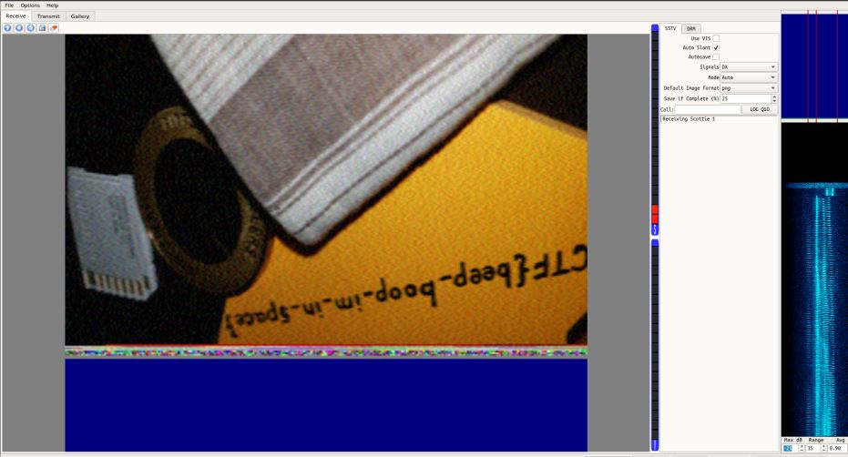

# m00nwalk
Points: 250
## Category
Forensics
## Problem Statement
> Decode this [message](message.wav) from the moon. You can also find the file in /problems/m00nwalk_3_03dab5f4d1deab675e80ee603fb02236.
## Hints
> How did pictures from the moon landing get sent back to Earth?
> What is the CMU mascot?, that might help select a RX option
## Solution
To answer the first hint for this problem, pictures were sent via sound waves through something called SSTV during the moon landing. We can use a software like QSSTV to decode the wav file into an image.

## Flag
`picoCTF{beep-boop-im-in-space}`