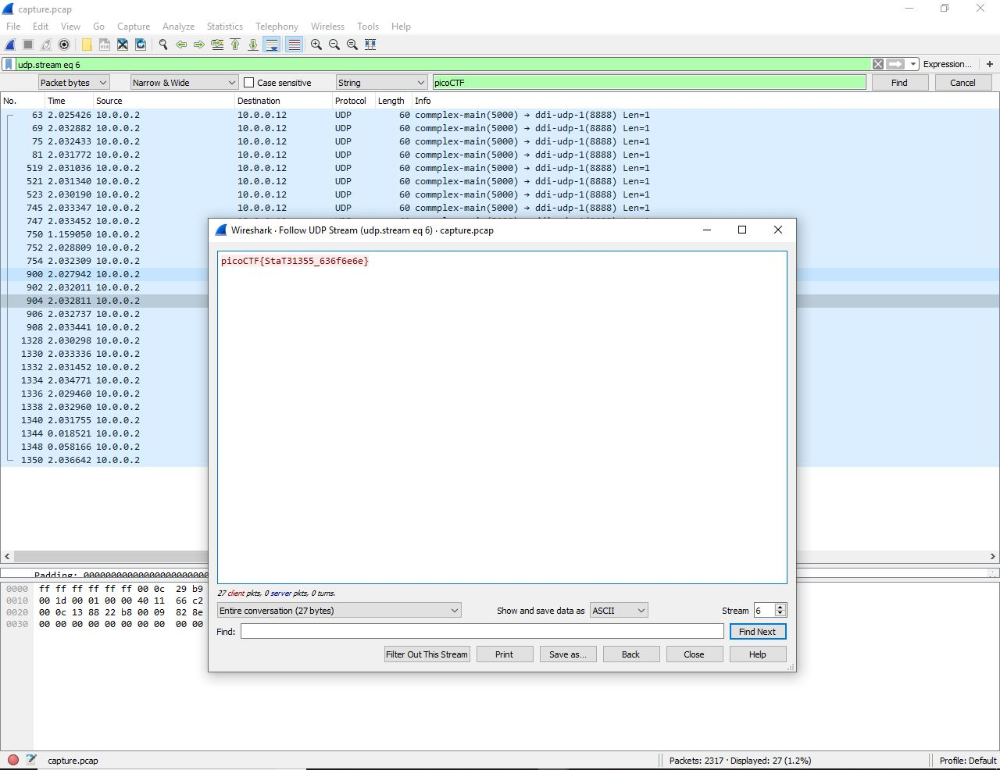

# shark on wire 1
Points: 150
## Category
Forensics
## Problem Statement
> We found this [packet capture](capture.pcap). Recover the flag. You can also find the file in /problems/shark-on-wire-1_0_13d709ec13952807e477ba1b5404e620.
## Hints
> Try using a tool like Wireshark
> What are streams?
## Solution
The title and hint tell us to use WireShark, which is a tool that analyzes network data from a capture. The second hint tells us to look at the streams. Once we open the packet capture on WireShark, we can start by filtering the streams. We'll filter for UDP streams, starting with the filter `udp.stream eq 0` in the display filter bar or using Ctrl+/ on Windows. We can then analyze this stream by going to Analyze > Follow > UDP Stream or using the shortcut Ctrl+Alt+Shift+U on Windows. This will give us some random data, so we go on to the next filter `udp.stream eq 1`. Eventually at `udp.stream eq 6` we find our flag.

## Flag
`picoCTF{StaT31355_636f6e6e}`