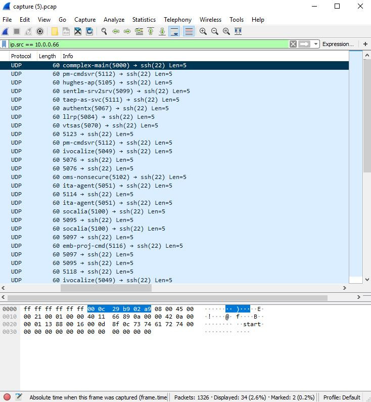

# shark on wire 2
Points: 300
## Category
Forensics
## Problem Statement
> We found this [packet capture](capture.pcap). Recover the flag that was pilfered from the network. You can also find the file in /problems/shark-on-wire-2_0_3e92bfbdb2f6d0e25b8d019453fdbf07.
## Solution
This was one of the rather tricky problems out of the Forensics category. While WireShark was still the only tool we needed to use, following the streams for the flag were no use, and there were in fact many false flags scattered throughout to trick you. However, if you did filter by doing Ctrl+F on Windows Cmd+F on Linux/MacOS, and filter for the strings "start" and "end" in the packet bytes, you'll find a packet with its data being "start" and another packet later on in time with its data being "end". I found this out by just going through the packet bytes of each packet until something stood out. The start packet has an IP address of 10.0.0.66. More packets with this same address follow it, up until the end packet. This looks promising, so lets filter for just packets coming from that address. Go to the display filter bar or use the shortcut Ctrl+/ on Windows and filter for `ip.addr == 10.0.0.66`. This narrows down the number of packets a lot. We can then look at more details about the transportation of these packets by checking View > Name Resolution > Resolve Transport Address. We then see that in the packet info of each packet, there is a 4 digit number somewhere starting with the number 5. If we then take the last 3 digits of each number in the order of the packet times and convert them to ASCII, we can get our flag.

## Flag
`picoCTF{p1LLf3r3data_v1a_st3g0}`