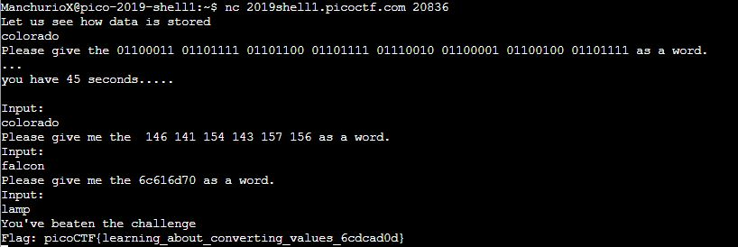

# Bases
Points: 200
## Category
General Skills
## Problem Statement
> To get truly 1337, you must understand different data encodings, such as hexadecimal or binary. Can you get the flag from this program to prove you are on the way to becoming 1337? Connect with `nc 2019shell1.picoctf.com 20836`.
## Hints
> I hear python can convert things.
> It might help to have multiple windows open
## Solution
Once we connect with the port, we are given a set of questions asking us to convert numbers into words. After a few attempts, we can notice that the numbers are of different bases, and you need to convert them into ASCII to get these words. The questions are also timed and randomized, so you have to follow their time. We could use an online resource or make a [script](Based.py). Ultimatly, the first one is binary to ASCII, the second one is octal to ASCII, and the third one is hexadecimal to ASCII. Once we answers these correctly and on time, we get the flag.

## Flag
`picoCTF{learning_about_converting_values_6cdcad0d}`