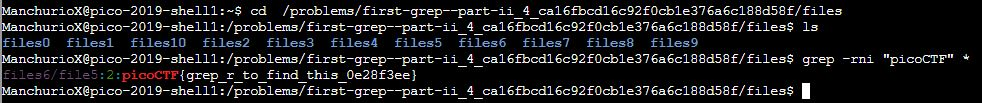

# First Grep: Part II
Points: 200
## Category
General Skills
## Problem Statement
> Can you find the flag in /problems/first-grep--part-ii_4_ca16fbcd16c92f0cb1e376a6c188d58f/files on the shell server? Remember to use grep.
## Hints
> grep [tutorial](https://ryanstutorials.net/linuxtutorial/grep.php)
## Solution
Once again we are faced with the challenge of filtering for a specific expression, this time across many files in a directory. Since manually checking each and every file- even with grep- is too much of a hassle, we use grep to search across multiple files at once instead. By using the command `grep -ri "picoCTF" *` we can successfully find the flag through all the files in the directory. As for the parameters, `r` allows us to search recursively and `i` makes it a case-sensitive search.

## Flag
`picoCTF{grep_r_to_find_this_0e28f3ee}`