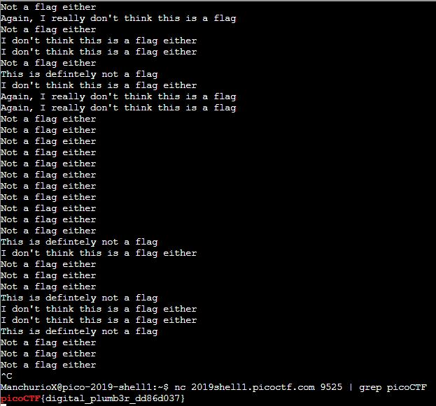

# plumbing
Points: 200
## Category
General Skills
## Problem Statement
> Sometimes you need to handle process data outside of a file. Can you find a way to keep the output from this program and search for the flag? Connect to `2019shell1.picoctf.com 9525`.
## Hints
> Remember the flag format is picoCTF{XXXX}
> What's a pipe? No not that kind of pipe... This [kind](http://www.linfo.org/pipes.html)
## Solution
After connecting to this port, we are greeted with many lines of filler messages. Hee, we can use a pipe `|`. What a pipe does in shell is it allows us to combine two commands in to one. SO, if we wanted to grep the return value of the netcat host connection for a flag, we can run `nc 2019shell1.picoctf.com 9525 | grep picoCTF`.

## Flag
`picoCTF{digital_plumb3r_dd86d037}`