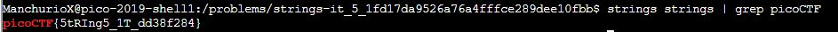

# strings it
Points: 100
## Category
General Skills
## Problem Statement
> Can you find the flag in [file](strings) without running it? You can also find the file in /problems/strings-it_5_1fd17da9526a76a4fffce289dee10fbb on the shell server.
## Hints
> [strings](https://linux.die.net/man/1/strings)
## Solution
The title and tutorial in the hint seems to point towards using the `strings` command like `strings strings` to get the flag. However, we are met with a lot of plain-text upon doing so, which would be quite the hassle to sort through manually. Instead, we can use the `grep` command which filters for specifc  expressions in plain-text. Since we know the format of picoCTF flags is picoCTF{...}, we can grep for picoCTF. The command would then be `strings strings | grep picoCTF`

## Flag
`picoCTF{5tRIng5_1T_dd38f284}`