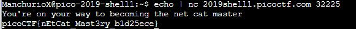

# what's a net cat?
Points: 100
## Category
General Skills
## Problem Statement
> Using netcat (nc) is going to be pretty important. Can you connect to `2019shell1.picoctf.com` at port `32225` to get the flag?
## Hints
> nc [tutorial](https://linux.die.net/man/1/nc)
## Solution
As the problem statement has given us the host and the port, all we have to do is talk to it. Simply echo the message gotten when connecting to it using `echo | nc 2019shell1.picoctf.com 32225`.

## Flag
`picoCTF{nEtCat_Mast3ry_b1d25ece}`