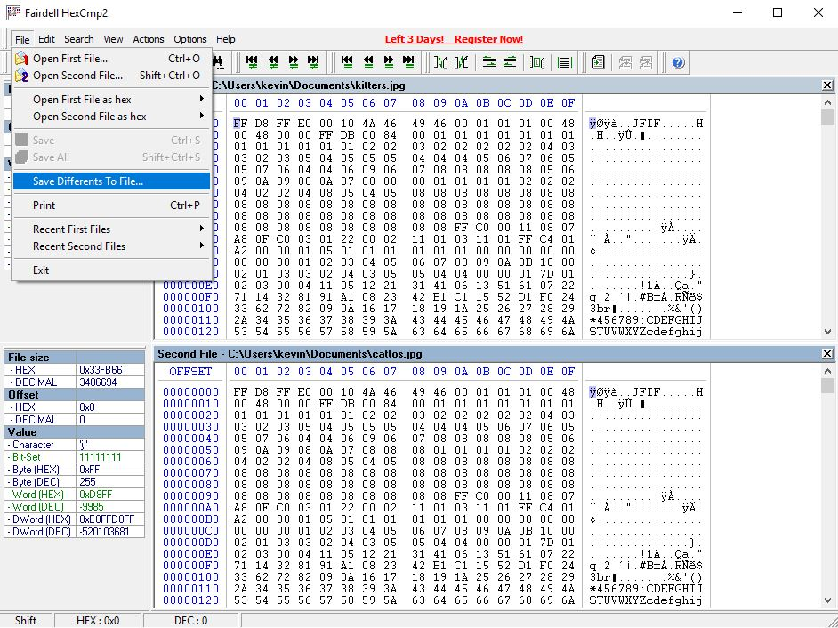

# whats-the-difference
Points: 200
## Category
General Skills
## Problem Statement
> Can you spot the difference? [kitters](kitters.jpg) [cattos](cattos.jpg). They are also available at /problems/whats-the-difference_0_00862749a2aeb45993f36cc9cf98a47a on the shell server
## Hints
> How do you find the difference between two files?
> Dumping the data from a hex editor may make it easier to compare.
## Solution
While the first instinct may be to just `diff` these two files on the shell, we quickly see that it gets us nothing but filler messages as it diffs for lines rather than bytes. For this, we need to use a hex editor to compare the files byte by bytes. I used HexCmp 2, which has a free trial. Once we open both of these files with HexCmp 2, we can go to File > Save Differents to File, in which it then makes a plain-text file like [this](differ). 

Since cattos seems to be the data that is changed just by looking at the image, we convert the differences there using an online tool such as [RapidTables](https://www.rapidtables.com/convert/number/hex-to-ascii.html) from hexadecimal to ASCII to get our flag.
## Flag
`picoCTF{th3yr3_a5_d1ff3r3nt_4s_bu773r_4nd_j311y_aslkjfdsalkfslkflkjdsfdszmz10548}`