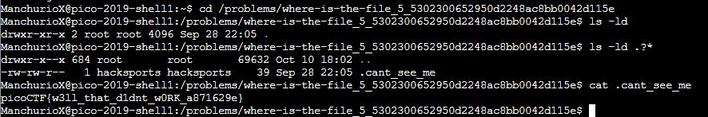

# where-is-the-file
Points: 200
## Category
General Skills
## Problem Statement
> I've used a super secret mind trick to hide this file. Maybe something lies in /problems/where-is-the-file_5_5302300652950d2248ac8bb0042d115e.
## Hints
> What command can see/read files?
> What's in the manual page of ls?
## Solution
Our file here is a hidden dot file, which can be revealed by doing `ls -ld .?*`. The ld parameters cause it to long list the directory entries, and the .?* causes it to only print the hidden files. Once we the .cant_see_me file, we simply have to `cat .cant_see_me` to see its contents and the flag.

## Flag
`picoCTF{w3ll_that_d1dnt_w0RK_a871629e}`