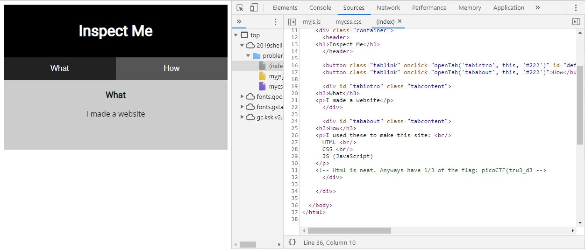

# Insp3ct0r
Points: 50
## Category
Web Exploitation
## Problem Statement
> Kishor Balan tipped us off that the following code may need inspection: `https://2019shell1.picoctf.com/problem/11196/` ([link](https://2019shell1.picoctf.com/problem/11196/)) or http://2019shell1.picoctf.com:11196
## Hints
> How do you inspect web code on a browser?
> There's 3 parts
## Solution
Here, we see a website with not much content. We are hinted by the problem statement to "inspect" the site. Using a browser's developing tools, we can see the source code of the site. On Chrome, this is the Inspect Element option, which can be found by right clicking or Ctrl+Shift+C on Windows, Cmd+Shift+C on Linux/MacOS. We then go to the Source tab and view the index.html, mycss.css, and myjs.js files, each containing a part of the flag.

## Flag
`picoCTF{tru3_d3t3ct1ve_0r_ju5t _lucky?9df7e69a}`