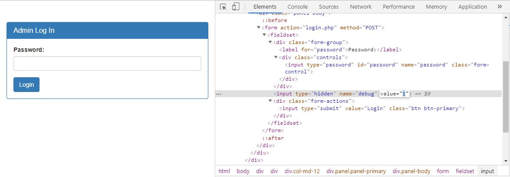

# Irish-Name-Repo 3
Points: 400
## Category
Web Exploitation
## Problem Statement
> There is a secure website running at `https://2019shell1.picoctf.com/problem/4161/` ([link](https://2019shell1.picoctf.com/problem/4161/)) or http://2019shell1.picoctf.com:4161. Try to see if you can login as admin!
## Hints
> Seems like the password is encrypted.
## Solution
Once again we are brought back to what seems like the same page as in Irish-Name-Repo 1 and 2. Except this time,when we enter a SQL Injection such as `' or 1=1--`, we get a server side HTTP error 500. We also note that there is now only a password input, so no way of revealing anything... or is there? When we inspect element this page, we can notice that there is more than one input, just that one of them is hidden and set to 0. If we set this to 1, we can actually see the query we are inputting after the encryption that messes up our injections occurs.

This time, when we inject the same injection `' or 1=1--`, we get back our encrypted query:
```
password: ' or 1=1--
SQL query: SELECT * FROM admin where password = '' be 1=1--'
```
We see that the alphabetical characters 'o' and 'r' have been swapped to a 'b' and 'e'. Curious. Let's try putting every letter in the alphabet after the comment to see exactly what type of encryption this is while setting the hidden input to 1 still.
```
password: ' or 1=1--abcdefghijklmnopqrstuvwxyz
SQL query: SELECT * FROM admin where password = '' be 1=1--nopqrstuvwxyzabcdefghijklm'
```
We can now confirm that this is some type of Caesar cipher. The characters for the word `OR` are substituted for `BE`. We try our query again, this time following the encryption, as so: `' be 1=1--`. The portal lets us through, and we finally see our flag.
## Flag
`picoCTF{3v3n_m0r3_SQL_d490b67d}`