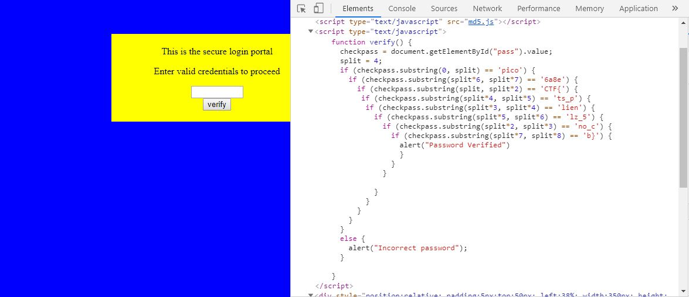

# dont-use-client-side
Points: 100
## Category
Web Exploitation
## Problem Statement
> Can you break into this super secure portal? `https://2019shell1.picoctf.com/problem/21888/` ([link](https://2019shell1.picoctf.com/problem/21888/)) or http://2019shell1.picoctf.com:21888
## Hints
> Never trust the client
## Solution
Here, we are faced with a simple login portal. As the title and hint cheekily warn us, it is a bad idea to store passwords on the client side of websites. By inspecting element or viewing the page source, we can clearly see that there is a script in the site's HTML that breaks down the password into substrings. When we match the substrings with the indices given, we get the password which is the flag.

## Flag
`picoCTF{no_clients_plz_56a8eb}`