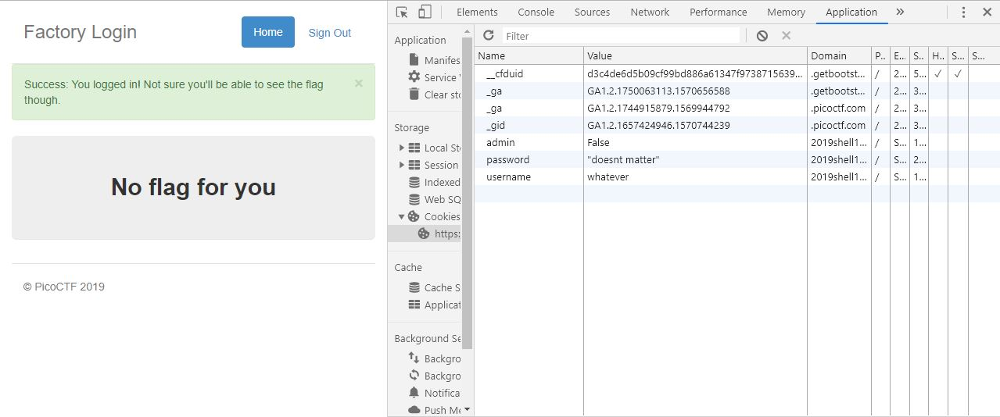

# logon
Points: 100
## Category
Web Exploitation
## Problem Statement
> The factory is hiding things from all of its users. Can you login as logon and find what they've been looking at? `https://2019shell1.picoctf.com/problem/49907/` ([link](https://2019shell1.picoctf.com/problem/49907/)) or http://2019shell1.picoctf.com:49907
## Hints
> Hmm it doesn't seem to check anyone's password, except for {{name}}'s?
## Solution
We are faced with a more challenging portal that does not have any secure information on the client side. However, we can still bypass it by manipulating the cookies. If we inspect element and go to the Application tab, we can see that the site stores three cookies upon login: a username string, a password string, and an admin boolean. By changing the admin cookie from False to True, we manipulate the server into thinking that we are an admin, and login to the site.

## Flag
`picoCTF{th3_c0nsp1r4cy_l1v3s_9e21365b}`