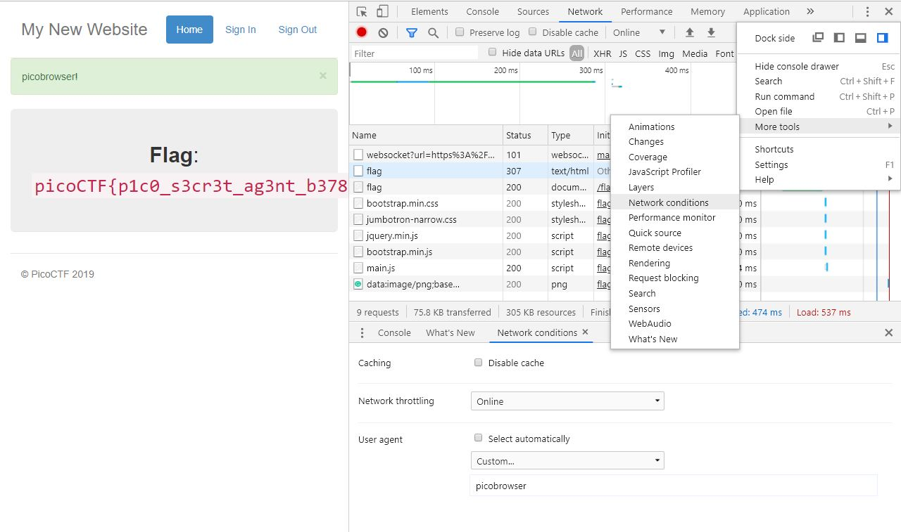

# picobrowser
Points: 200
## Category
Web Exploitation
## Problem Statement
> This website can be rendered only by **picobrowser**, go and catch the flag! `https://2019shell1.picoctf.com/problem/45071/` ([link](https://2019shell1.picoctf.com/problem/45071/)) or http://2019shell1.picoctf.com:45071
## Hints
> You dont need to download a new web browser
## Solution
We see here a site that check the browser for a specific browser before letting you in. Since picobrowser is obviously not the name of an actual web browser, it will prevent you from accessing it. Here, we need to look into the site's Network conditions. On Chrome, after navigating to the developer tools, go to the three dots on the upper right corner and select More Tools > Network conditions. From there, you should see an option to change the User agent to a custom one. If you change it to **picobrowser**, the site lets you through to the flag.

## Flag
`picoCTF{p1c0_s3cr3t_ag3nt_b3785d03}`